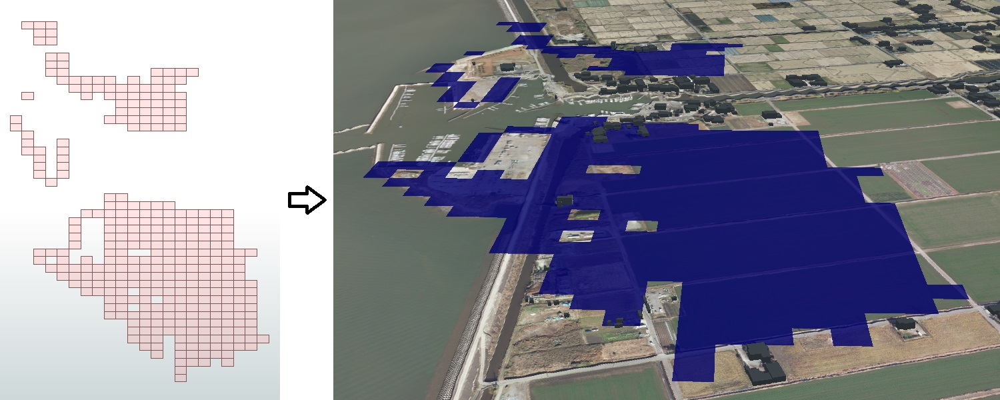
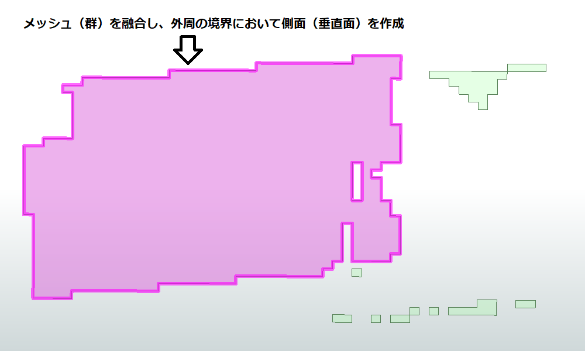
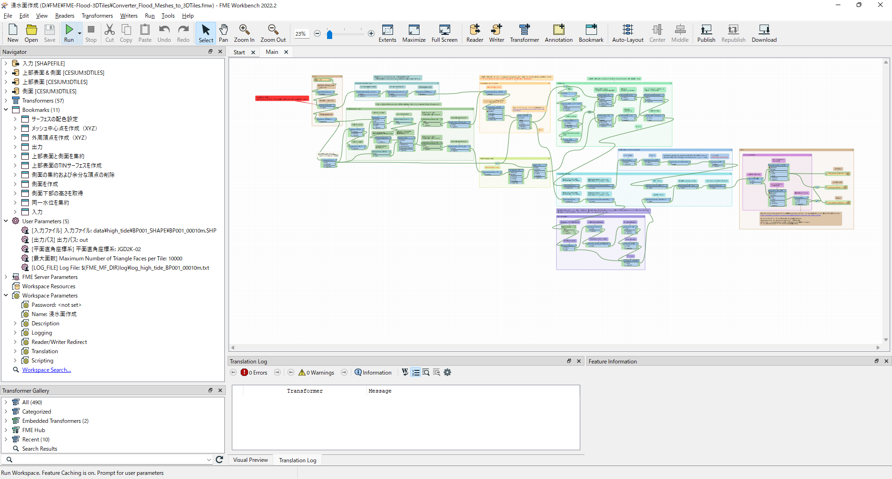

# 3D浸水面データ作成プログラムのマニュアル

# 1. 概要

本プログラムは、「FME Desktop」を用いて一般的なメッシュ別浸水深データ（シェープファイル）から3D浸水面データ（3D Tiles形式）を作成するものです。

| ファイル名                            | 説明                                                                                                                                                                                                                                                                                                                                                                                                                     |
|:---------------------|:-------------------------------------------------|
| Converter_Flood_Meshes_to_3DTiles.fmw | FMEのワークスペースファイルです。メッシュ別浸水深データの読込から、いくつかの処理アルゴリズムを経て3D Tiles形式で出力するための処理フローが記述されており、「FME Desktop」で実行できます。浸水位についてはTIN（メッシュ中心点間を接続した三角形）で表現し、メッシュ（群）の外周の境界については地盤から浸水位までの側面（垂直面）を生成します。                                                                |
| Example_of_Batch_Processing.bat       | 「Converter_Flood_Meshes_to_3DTiles.fmw」では、1つのシェープファイル（メッシュ群）に対して処理が実行されます。よって、時刻（時間帯）別に整備された浸水深データに対して連続的にプログラムを実行する際には、このようなバッチファイルを用いることで、入力ファイルやパラメータを変えながら、繰り返し処理を実行することが可能です。なお、FME自体にも繰り返し処理を実行するためのランナー機能（`WorkspaceRunner`）があります。 |



***



# 2. FMEについて

FMEはSafe Software社（カナダ）が開発しているデータ変換エンジンで、商用ソフトウェア（業務目的で利用する場合はライセンスの購入が必要）です。

「トランスフォーマー」と呼ばれる各種機能（アルゴリズム）を画面上※に配置し、それらを接続することで処理フローを構築できるため、視覚的に分かりやすく、また多くのデータ変換・加工機能により複雑な処理も可能としているため、PLATEAUの取組においても随所で活用されています。

※「FME Workbench」というFMEのうち処理フローの作成・編集を担うソフトで作業をします。



## 参考（PLATEAUの記事）

-   [CityGMLから各種データ形式へのコンバート[1/2]｜FME Desktopの機能と基本的な使い方](https://www.mlit.go.jp/plateau/learning/tpc04-1/)
-   [CityGMLから各種データ形式へのコンバート[2/2]｜FME Desktopでのワークベンチ改造例、変換方法](https://www.mlit.go.jp/plateau/learning/tpc04-2/)

# 3. プログラム内容

## 入力ファイルについて

サンプルデータとして、熊本県高潮浸水想定における発災後 0分、10分、20分のシェープファイル（JGD2000 / 緯度経度）を用意しています。

なお、本プログラムでは、一般的なメッシュ形状に対して浸水深および標高（地盤高）の属性項目を持っているシェープファイルを入力データとして想定しており、これらの属性項目のフィールド名が「浸水深」および「標高」となっていることを前提としています。そのため、シェープファイルと本ワークスペースで属性項目の名称が異なる場合、名称について調整が必要となります（トランスフォーマー「`AttributeCreator_高さ`」の記述を修正してください）。また、入力データに標高（地盤高）が付与されていない場合は、別途DEM（数値標高モデル）データ等から高さを取得して浸水位【標高（地盤高）＋浸水深】を算出する必要があります。FMEで空間演算によりデータ取得する場合は、`SpatialRelator`トランスフォーマー等が利用できます。

## パラメータ設定

本プログラムでは、ユーザーパラメータを5つ設定しています。

| 名称           | 内容                                                                                                                       |
|--------------|----------------------------------------------------------|
| 入力ファイル   | 入力するシェープファイル（拡張子：shp）のパスを指定します。                                                                |
| 出力パス       | 出力ディレクトリのパスを指定します。ディレクトリが存在しない場合は自動で作成されます。                                     |
| 平面直角座標系 | 処理途中に平面直角座標系に変換するため、入力データの地域に応じた系番号の座標参照系を指定します（熊本県は2系、関東は9系）。 |
| 最大面数       | 3D Tilesの1タイルあたりの最大面数で、100 ～ 10,000を設定できます。値を大きくするとファイル数が減少し、ファイル移動等や実行環境立ち上げでの所要時間が短縮し、全体のデータサイズについては小さくなります。一方、3D Tilesの描画時には、特にズームレベルが高い場合において、カメラの画角範囲外の描画に必要ない面に関するデータ通信が発生しやすくなります。 |
| LOG_FILE       | ログファイル（テキスト形式）のパスを指定します。出力先のディレクトリが存在しない場合はエラー停止します。      |

## グリッドファイルの追加

このワークスペースによる変換を実行するには、標高から楕円体高への変換用にFMEの "Reprojection Grid Files" (無償) に含まれるグリッドファイルが必要です。このワークスペースによる変換を実行する前に、こちらの [FME Downloads](https://www.safe.com/support/downloads/) ページより "Reprojection Grid Files" をダウンロードし、解凍して展開される "Reproject" フォルダー以下のファイルをすべて、FME Desktop インストール先フォルダー内の "Reproject" フォルダー以下にコピーしてください。

## 実行方法

以下の2種類の方法について紹介します。

-   ワークスペースファイルをFME Workbenchで開いてツールバーのRunボタン（緑色の三角ボタン）をクリックし、ポップアップしたダイアログウィンドウで再びRunボタン（緑色の三角ボタン）をクリック

-   バッチファイル（コマンドライン）から実行（実行ファイルやワークスペースファイル、ユーザーパラメータ等の記述が合っている必要があります）

## バッチ処理について

次のように記述したバッチファイル（拡張子：bat）を用意することで、時刻（時間帯）別の繰り返し処理を実行できます。

```
    @echo off

    mkdir log

    : 「遅延環境変数の展開」は必要なし
    for %%M in (00000 00010 00020) do (
      title 高潮 %%Mmin
      echo ==================================================
      echo 高潮 %%Mmin
      "C:\Program Files\FME\fme.exe" Converter_Flood_Meshes_to_3DTiles.fmw ^
        --入力ファイル data\high_tide\BP001_SHAPE\BP001_%%Mm.SHP ^
        --出力パス out ^
        --平面直角座標系 JGD2K-02 ^
        --最大面数 10000 ^
        --LOG_FILE log\log_high_tide_BP001_%%Mm.txt
    )

    pause
```

-   `for`コマンドで処理を繰り返します
-   `00000 00010 00020`は基準時からの経過時間（分）
-   FMEの実行ファイルを絶対パスで記述（インストール先に応じて変更、例：`"C:\Program Files\FME\fme.exe"`）
-   実行したいワークスペースファイル（拡張子：fmw）および入出力ファイル（もしくはディレクトリ）についてはバッチファイルから見た相対パスで記述
-   `--パラメータ名 & 半角スペース & 設定内容`でワークスペースの各パラメータについて記述（`^`でコマンドラインを継続）
-   ログファイルの出力ディレクトリをあらかじめ作成（`mkdir log`、存在しない場合はエラー停止）
-   `for`コマンドによる繰り返し処理の際、ブロック内で環境変数（可変値）を利用する場合は「遅延環境変数の展開」の対応が必要（説明は省略します）

# 4. 注意事項

## 処理内容について

本プログラムは、浸水位面の他に、元のメッシュ群の外周境界における側面（垂直面）も作成するために、PLATEAUの[「3D都市モデルを活用した災害リスク情報の可視化マニュアル」](https://www.mlit.go.jp/plateau/file/libraries/doc/plateau_doc_0005_ver01.pdf)で紹介されている一般的な浸水データの変換方法（処理フロー）とは異なる部分があります。そのため、ある程度の検証は実施していますが、処理速度やデータサイズ、3D描画時の読込速度等に関しては最適化されていません。

## 利用バージョンについて

FMEのバージョンは2022.1以降を利用してください。バージョン2022.0までは3D Tilesの出力において表示範囲に関する数値にバグがあり、カメラの方向（画角）によってはオブジェクトが表示されないという現象が発生することを確認しました。また、コマンドラインを用いたバッチ処理に関してもバージョン2022.0ではエラー停止が発生しやすいことを確認しました。

なお、本プログラムはバージョン2022.2で動作検証を実施しています。
