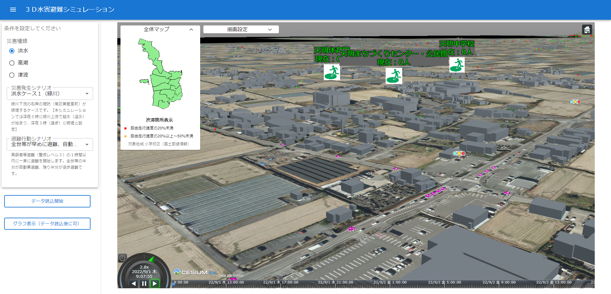

# FY2022 Project PLATEAU UC22-039「徒歩及び車による時系列水害避難行動シミュレーション」の成果物
### evacuation-simulation-tools

## 1. 概要

3D都市モデルを利⽤した徒歩及び車を利用した水害避難シミュレーションを実施するためのプログラムです。  
本リポジトリには以下が含まれています。
- シミュレーションに必要な3種類の処理に関するプログラムのソースコード及びサンプルデータ
- シミュレーション結果を閲覧・操作するためのウェブビューアの操作マニュアル
- ウェブビューア運用のためのサーバー環境構築方法について記したドキュメント

## 2. 「徒歩及び車による時系列水害避難行動シミュレーション」について

### ユースケースの概要

令和4年度の3D都市モデルを活用した社会的課題解決型ユースケース開発業務「徒歩及び車による時系列水害避難行動シミュレーション」では、熊本県熊本市を対象に、3D都市モデルをベースとして、洪水、高潮、津波等の災害発生時の時系列的な徒歩及び車による住民の避難行動をシミュレーションするシステムを開発しました。  

### 開発システムの概要

本ユースケースでは、『3D水害避難シミュレーションシステム』と『3Dパーソナル避難シミュレーションソフトウェア』という2つのシステムを開発しました。

- 『3D水害避難シミュレーションシステム』では、徒歩避難者と自動車の移動を道路ネットワーク上に再現するシミュレーションシステムを開発しました。  
  - このシステムでは、対象エリアの道路ネットワークデータと避難者の避難開始地点、避難先、避難開始時刻を入力することで、徒歩及び自動車における個々の避難者の時刻別の位置情報の出力と避難経路の生成を行います。  
  - 徒歩による避難シミュレーションでは、避難者特性（高齢者等）に応じた歩行速度を設定することができます。
  - 自動車による避難私有地では、道路混雑による速度低下をモデルで考慮できます。
  - 洪水、高潮、津波のメッシュ別時系列浸水深データから作成した時刻別の三次元浸水データを重ね合わせることで、3D都市モデル上で避難行動と浸水域の時系列変化を同時に再現することが可能です。
  - ユーザー自ら災害種別や避難シナリオ（避難のタイミングや徒歩と自動車の割合）を選択し、これに応じたシミュレーション結果を閲覧できるGUIを構築しています。

- 『3Dパーソナル避難シミュレーションソフトウェア』では、上記システムで計算したシミュレーション結果をもとに、ユーザーが避難開始地点、避難開始のタイミング、避難先、移動手段等を指定することで、特定の個人・世帯の避難状況を主観的に再現するシステムを開発しました。

- 上記２つのシステムのバックエンドはFortranを用い、フロントエンドはウェブ上でユーザーがシミュレーション結果を閲覧及び操作できるよう、3D地理情報の表示部分をCesium、UIをReact等で構成しました。

- これらのシステムはクラウドサーバー上で公開され、自治体職員や住民等がパソコンからブラウザーを用いて自由にアクセスし、利用できる環境を整備しました。

## 3. 掲載内容

本リポジトリの掲載内容は次の表のとおりです。具体的な内容については、リンク先の各資料をご参照ください。

|                                | 概要                                                                                                                                                                                                                                                                                                                                                                                                                      | リンク                                                                                                     |
|:-------------------------------|:--------------------------------------------------------------------------------------------------------------------------------------------------------------------------------------------------------------------------------------------------------------------------------------------------------------------------------------------------------------------------------------------------------------------------|----------------------------------------------------------------------------------------------------------------|
| viewer                         | 本ユースケースで開発した「3D水害避難シミュレーションシステム」および「3Dパーソナル避難シミュレーションソフトウェア」におけるシミュレーション結果を閲覧するためのウェブビューアに関するソースコード類です。                                                                                                                                                                                                                                      | [3D水害避難シミュレーションのウェブビューアのマニュアル](/viewer/Manual_for_Web_Viewer_System.md)              |
| make-CZML                      | 本ユースケースで開発した水害避難シミュレーションの出力結果である避難者の移動に関するログデータ（テキスト形式）を、ウェブビューアの3D地理空間描画部分を担うCesiumJSで読み込めるCZML形式に変換するためのRプログラムのソースコードです。ウェブビューアへの入力データとなる各種集計データも作成します。こちらは、技術検証レポート（参考資料）の「3D水害避難シミュレーションシステム」における「3D描画サブシステム」の部分に当たります。 | [避難者ログデータ変換プログラムのマニュアル](/make-CZML/Manual_for_Converter_Evacuees_Log_to_CZML.md)          |
| FME-Flood-3DTiles              | 一般的なメッシュ別浸水深データ（シェープファイル）から、3D浸水面データ（ウェブビューアの3D地理空間描画部分を担うCesiumJSで読み込める3D Tiles形式）を作成するためのFMEのプログラム実行例です。こちらは、技術検証レポート（参考資料）の「3D水害避難シミュレーションシステム」における「3D浸水シミュレーションサブシステム」の部分に当たります。                                                                                       | [3D浸水面データ作成プログラムのマニュアル](/FME-Flood-3DTiles/Manual_for_Converter_Flood_Meshes_to_3DTiles.md) |
| ウェブビューアの操作マニュアル | シミュレーション結果を閲覧・操作するためのウェブビューアの操作方法について記述しています。                                                                                                                                                                                                                                                                                                                                | [熊本市水害避難シミュレーション操作マニュアル](./User's_Manual_for_Web_Viewer.pdf)                            |
| サーバー環境構築方法           | ウェブビューア運用のためのサーバー環境構築方法について記述しています。                                                                                                                                                                                                                                                                                                                                                      | [サーバー環境構築方法](./Server_Setting_Method.pdf)                                                         |

***

データアーキテクチャ全体図を以下に掲載します。詳しくは、参考資料の[技術検証レポート](https://www.mlit.go.jp/plateau/file/libraries/doc/plateau_tech_doc_0018_ver01.pdf)をご参照ください。

## ライセンス

-   ソースコードおよび関連ドキュメントの著作権は国土交通省に帰属します。
-   本ドキュメントは[Project PLATEAUのサイトポリシー](https://www.mlit.go.jp/plateau/site-policy/)（CCBY4.0および政府標準利用規約2.0）に従い提供されています。

## 注意事項

-   本リポジトリは参考資料として提供しているものです。動作保証は行っておりません。
-   予告なく変更・削除する可能性があります。
-   本リポジトリの利用により生じた損失及び損害等について、国土交通省はいかなる責任も負わないものとします。

## 参考資料

-   徒歩及び車による時系列水害避難行動シミュレーション技術検証レポート: <https://www.mlit.go.jp/plateau/file/libraries/doc/plateau_tech_doc_0018_ver01.pdf>
-   PLATEAU Webサイト Use caseページ「徒歩及び車による時系列水害避難行動シミュレーション」: <https://www.mlit.go.jp/plateau/use-case/uc22-039/>
-   CesiumJS: <https://cesium.com/platform/cesiumjs/>
-   Resium: <https://resium.reearth.io/>
-   React: <https://ja.reactjs.org/>
-   Material UI: <https://mui.com/>
-   FME: <https://www.safe.com/fme/>
