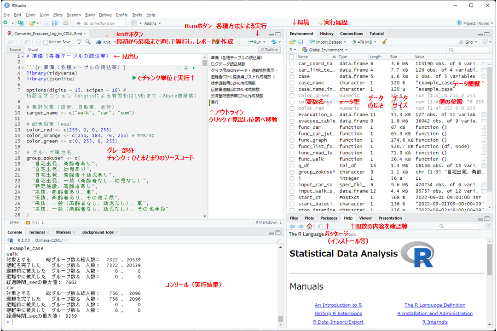
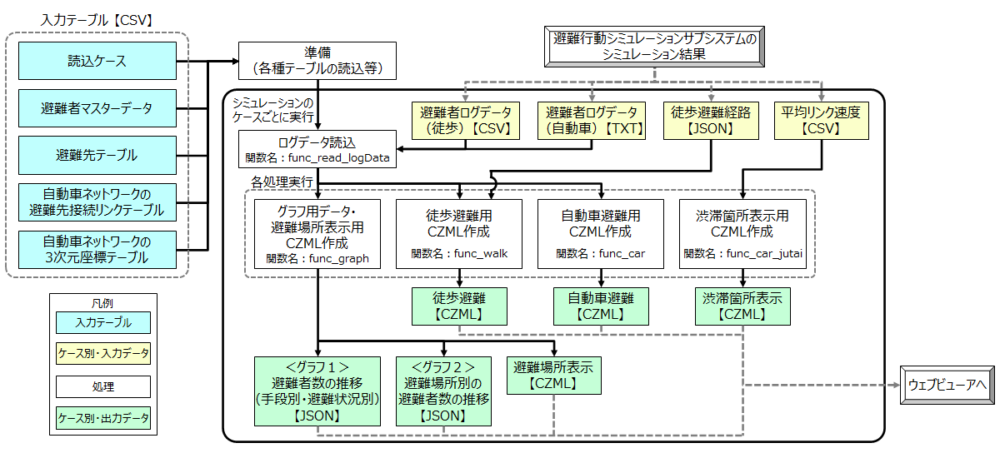
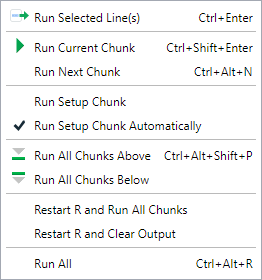

# 避難者ログデータ変換プログラムのマニュアル

# 1. 概要

本プログラムは、本ユースケースで開発した水害避難シミュレーションの出力結果である避難者の移動に関するログデータ（テキスト形式）から、JavaScript用のオープンソースの3D地理空間可視化ライブラリであるCesiumJSで読み込めるデータ形式であるCZMLファイル（JSON形式）等を作成するものです。また、避難場所別の避難者数をラベル表示するための集計や渋滞箇所表示用データの作成、ウェブビューアで避難者数の推移を表示するためのグラフ用データの作成も同時に実施します。

| ファイル名                         | 説明                                                                                                                   |
|:-----------------------|:-----------------------------------------------|
| Converter_Evacuees_Log_to_CZML.Rmd | Rのソースコードファイルです。RのIDE（統合開発環境）である「RStudio」で実行できるマークダウン方式のものとなっています。 |

# 2. Rについて

R言語はオープンソース・フリーソフトウェアの統計解析向けプログラミング言語及びその開発実行環境です。

## 2.1 環境構築の手順

1.  Rを公式サイト[CRAN](https://cran.r-project.org/)からダウンロード、インストールしてください。
2.  Rを利用される際には、IDE（統合開発環境）を利用されることを推奨します。R本体のみでもプログラムの実行は可能ですが、例えばRの公式IDEである「RStudio」には便利な機能が数多く備わっています。RStudioにはいくつかの種類がありますが、「RStudio Desktop」が無償で利用できます。こちらの[DOWNLOAD RStudio Desktop](https://posit.co/download/rstudio-desktop/)からダウンロードしてください。R本体のインストール後、RStudioもインストールしてください。
3.  Rには、特定の目的・ジャンルにおけるデータの加工や分析で扱える関数等をひとまとめにした追加ライブラリがあり、Rでは「パッケージ」と呼称しています。必要に応じて、パッケージをダウンロード・インストールしてください。Rのパッケージのダウンロード・インストールは、Rのコマンド（`install.packages`関数）で実行できますが、RStudioではUIの操作（メニューバー \> Tools \> Install Packages...）でも実行できるため、そちらを利用すると便利です。本プログラムにおける利用パッケージは、2.3に記述しています。

## 2.2 RStudioについて

RStudioは以下の図のような構成となっています。ソースコードをマークダウン方式（拡張子：Rmd）とした場合は、機能ごとにチャンク（ひとまとまりのソースコード）を作成することで、管理・実行がしやすくなります。また、RStudioを用いることで、R本体のみの利用よりも変数の内容が確認しやすくなります（図の右上のEnvironment）。

## 2.3 利用パッケージについて

本プログラムでは、以下の2つのパッケージを利用しています。これらをダウンロード、インストールしてください。

| パッケージ名 | パッケージの用途                                                           |
|:-----------------------|:-----------------------------------------------|
| tidyverse    | データフレーム形式（縦にレコード、横に属性項目を基本とするデータ）の加工等 |
| jsonlite     | JSONファイルの入出力や変換                                                 |

# 3. プログラム内容について

## 3.1 プログラムの処理フロー

本プログラムの処理フロー図を以下に示します。

本プログラムでは、入力テーブルの1つである「読込ケース」の記述に従い、複数ケースのシミュレーション結果（避難者ログデータ等）について連続的に加工・変換処理を実行します。なお、CZML形式はCesium専用のファイル形式ですが、記述方法自体はJSON形式に従います。

## 3.2 プログラムの処理内容

本プログラムの内容について以下に示します。

1.  データ加工の準備（各種テーブルの読込やパラメータの設定等）

    | データの種類                                 | 内容                                                                         | ファイル名（パス）                             |
    |:-------------------|:--------------------------------|:------------------|
    | 読込ケース                                   | ケースごとの入出力フォルダー名　等（実行ケース分を縦に並べる）               | dlib/Simulation_Case_Table.csv                 |
    | 避難者マスターデータ                         | グループ（世帯）の属性と人数、出発地の町丁目名・小学校名　等                 | dlib/Evacuees_Master_Data.csv                  |
    | 避難先テーブル                               | 徒歩・自動車避難における避難先（避難場所）の名称、緯度経度と高さ※1　等       | dlib/Evacuees_Destination_Table.csv            |
    | 自動車ネットワークの避難先接続リンクテーブル | 自動車ネットワークにおいて避難先に接続するリンク（属性表示ラベル作成で利用） | dlib/Car_Network_Link_to_Destination_Table.csv |
    | 自動車ネットワークの3次元座標テーブル        | リンク別・セクション別の緯度経度と高さ※1                                     | dlib/Car_Network_3D_Coordinates_Table.csv      |

2.  避難者ログデータ（徒歩避難、自動車避難）の読込（避難者、経過時間をキーとしてソート）

    避難者ログデータは経過時間ごとに各避難者（グループ）の状態を出力しているため、避難者（グループ番号）を第一優先キー、経過時間を第二優先キーとしたソート（並び替え）を実施する等、避難者ごとの処理をするための準備をします。

3.  避難者の属性情報の付与（ラベル作成）等のデータ加工を実施

    自動車避難では、前半の加工として停車時の処理※2（3D車両オブジェクトの進行方向の維持、レコード数の削減）を実施します。

4.  避難者ログデータをCZML（JSON）形式に変換して出力

    データフレーム形式での加工を実施した後、各オブジェクトの各項目をリスト形式で記述し、jsonliteパッケージの`toJSON`関数を用いてリスト形式からJSON（CZML）形式に変換します。出力の際は、ファイルサイズを軽量化するために、空白や改行を取り除くミニファイ（Minify）圧縮をしています。

5.  その他集計データを作成

    避難者データ（徒歩・自動車）以外に、以下の4種類のデータを作成します。

    | 作成データ                                       | 内容                                                                                                                                                                                                 |
    |:----------------------|:------------------------------------------------|
    | 避難場所表示用データ【CZML形式】                 | 避難先のうち熊本市の指定緊急避難場所（一時避難場所）について、ウェブビューア（CesiumJS）で避難場所のアイコンおよび名称、シミュレーション内の現在時刻までの避難者数の文字ラベルを表示するためのデータ |
    | 渋滞箇所表示用データ【CZML形式】                 | ウェブビューア（CesiumJS）内の全体マップ（2D）に渋滞箇所をポイント表示するためのデータ                                                                                                               |
    | 避難者数の推移（手段別・避難状況別）【JSON形式】 | ウェブビューア（Chart.js）で避難者数の推移（手段別・避難状況別）のグラフを描画するためのデータ（5分間隔の推移を算出）                                                                                |
    | 避難場所別の避難者数の推移【JSON形式】           | ウェブビューア（Chart.js）で避難場所別の避難者数の推移のグラフを描画するためのデータ（5分ごとに避難者数と累積避難者数を算出）                                                                        |

※1 各オブジェクトをCesiumJSで描画するために、高さには「楕円体高」を付与しています。楕円体高は、標高にジオイド高（地球表面の歪みを考慮した高さ）を足し合わせたもので、熊本市対象地域のジオイド高はおよそ32.5mです。避難先テーブルについては、描画対象（アイコンおよび文字列ラベル）のみ地点上空の高さを設定しています。

※2 Cesiumでは、CZMLファイルにオブジェクトの時空間情報として【基準時刻からの経過時間（秒）、経度、緯度、楕円体高】の4つの組合せを順に並べることで移動の軌跡を表現でき、オブジェクトの向きについても`"velocityReference": "#position"`を設定することで次の時間・位置（高さ含む）から自動計算されます。ただし、停車時（次の時刻も同じ位置に居る）はオブジェクトの正面が東を向く現象（Cesiumの挙動）が発生したため、停車時は最初と最後のみの2レコード（フレーム）のみを残し、さらに最初のレコードの座標を少しずらすことで微速前進させるような調整をしています。

## 3.3 サンプルデータについて

シミュレーション結果のサンプルデータをdata/example_caseに用意しています。読込ケースについて記述している「dlib/Simulation_Case_Table.csv」の内容に従って、ケースごとに処理しますが、サンプルとしては1ケースのみ（example_case）を実行します。

サンプルデータには以下の4種類のデータがあり、各データの読込についてはソースコードに記述してあります。なお、避難者ログデータ（自動車）についてはファイルサイズが大きかったため、元データに対して約10分の1の避難者グループ数にしています。

| データの種類               | 内容                                                                                                     | ファイル名                    |
|---------------|-------------------------------------------|--------------|
| 避難者ログデータ（徒歩）   | 徒歩避難シミュレーションにおける各避難者の交差点等（ノード）の経由状況（移動経路）について記録したデータ | walk_log.csv                  |
| 避難者ログデータ（自動車） | 自動車避難シミュレーションにおける一定時間間隔の各避難者の位置を記録したデータ                           | car_log.txt                   |
| 徒歩避難経路               | 徒歩避難シミュレーションの結果（ログデータ）から、各避難者の経路を作成したもの                           | walk_route.json               |
| 平均リンク速度             | 自動車避難シミュレーションの結果で、自動車用道路ネットワークのリンクごとの10分間の平均走行速度           | car_link_average_velocity.csv |

## 3.4 プログラムの実行方法

RStudioでのプログラムの実行方法について紹介します。ソースコードを部分的に実行するか、全体を実行するか等に応じて、実行方法を選択します。

1.  Rはインタプリタ型のプログラム言語ですので、1行ごと（プログラムとして意味のある最小単位）の実行が可能です。実行したいソースコードを範囲選択し、「Ctrl + Enter」で実行できます。既に作成済の変数であれば上書きされます。

2.  RStudioにはチャンク機能が備わっており、チャンクとしてプログラムをひとまとめにすることができ、チャンク単位でプログラムを実行できます（2.2 RStudioの機能の図「RStudioの構成」を参照）。機能単位やテスト等で実行する範囲でチャンクを設定することで、管理・実行がしやすくなります。また、チャンクに対してオプション設定を追加することができます。

3.  Runボタンをクリックすると以下のダイアログが表示され、選択に応じて実行されます。「Run All」では、全てのソースコードを実行します。

    

4.  ソースコードファイルがUTF-8形式の場合、Knitボタンをクリックすることで、ソースコードを最初から最後まで通しで実行し、さらに実行したRmdファイルと同一ディレクトリに実行内容のレポート（デフォルトはHTML形式）が作成されます。

## 3.5 動作検証

本プログラムは、以下の環境で動作検証を実施しました。

-   R 4.2.2 （R 4.2 から入出力ファイルの標準のエンコードの種類が、Shift-JIS（CP932）からUTF-8に変更になりました）

-   RStudio 2022.12.0 Build 353

-   tidyverse 1.3.2

-   jsonlite 1.8.3
