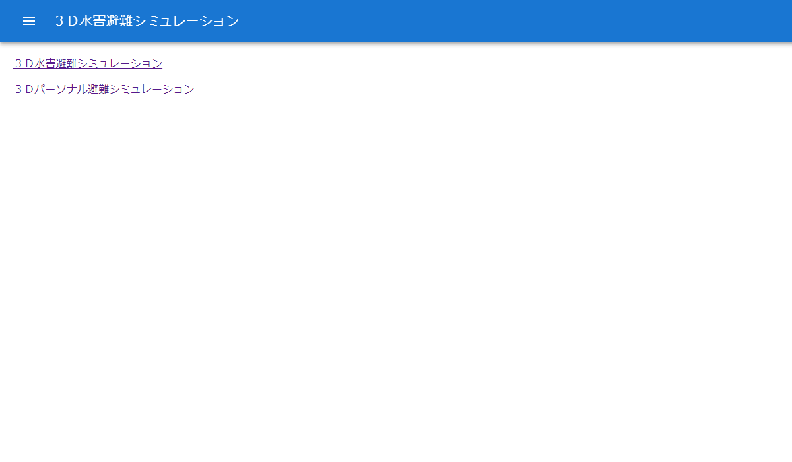

# 3D水害避難シミュレーションのウェブビューアのマニュアル

# 1. 概要

本ユースケースで開発した「3D水害避難シミュレーションシステム」および「3Dパーソナル避難シミュレーションソフトウェア」のウェブビューア部分のソースコード類およびサンプルデータと、「3Dパーソナル避難シミュレーションソフトウェア」のサーバー側処理における一部プログラムのソースコードを掲載しています。

サーバー環境構築方法については、[こちら](../Server_Setting_Method.pdf)をご参照ください。

| ディレクトリ | 説明                                                                                                                                                                                                                                                                                                                                                                                                                                                                                                                                                                                                                                     |
|:-------------------------|:---------------------------------------------|
| kumamoto3d   | 本ユースケースで開発した「3D水害避難シミュレーションシステム」および「3Dパーソナル避難シミュレーションソフトウェア」のウェブビューア部分のソースコード類とサンプルデータ（1ケース）を掲載しています。2.2の「利用方法」を参考に、本データをコピー、ライブラリを追加していただくことで、実際にブラウザで操作・閲覧していただくことも可能です。 |
| simulation   | 「3Dパーソナル避難シミュレーションソフトウェア」では、ウェブビューアにおいてユーザーが避難シミュレーションの条件設定を入力、実行すると、サーバー上でその条件設定に応じた避難経路を探索し、その結果をウェブビューアに返します。ここでは、そのサーバー側処理である避難経路探索プログラムのソースコードの一部を掲載しています。具体的には、ウェブビューア（クライアント）からシミュレーションの条件設定の入力を受け取り、シミュレーションを起動するためのPythonプログラムのソースファイル（personal.py）と、徒歩避難、自動車避難別の一連のFotranプログラムを実行するためのバッチファイル（walk.bat、car.bat）の3ファイルを掲載しています※。 |

※徒歩避難および自動車避難のバッチファイルに記載している各Fortranプログラム（一部パワーシェル）のソースコードは、本ユースケースの開発範囲の対象外のため**非掲載**としています。

# 2. ウェブビューア（メイン部分）について

## 2.1 利用ライブラリについて

本ユースケースで開発したウェブビューアは、JavaScript用のUIライブラリである「React」をベースに構築しています。利用した主なライブラリは以下のとおりです。

| ライブラリ名    | 説明                                                                           |
|--------------------------|----------------------------------------------|
| React           | JavaScriptのライブラリでUIの制御等で利用                                       |
| Material-UI     | ReactのUIの部品として各種コンポーネント（各種ボタン等の部品）が利用可能        |
| CesiumJS        | JavaScript用の3D対応地理空間可視化ライブラリ（PLATEAU VIEWでも利用されている） |
| Resium          | ReactでCesiumJSの機能が容易に扱えるようになるライブラリ                        |
| Chart.js        | JavaScript用のチャート（グラフ等の図表）を描画するためのライブラリ             |
| react-chartjs-2 | ReactでChart.jsの機能を扱えるようになるライブラリ                              |

## 2.2 利用方法

ここでは、Windowsパソコンのローカル環境での本ウェブビューアの利用方法を紹介します。サーバーに配置して利用される場合は、こちらの[サーバー環境構築方法](../Server_Setting_Method.pdf)もご参照ください。

**サンプルデータとして、災害種類が「洪水」、災害発生シナリオが「洪水ケース１（緑川）」、避難行動シナリオが「高齢者等が早めに避難、自動車避難が50％」のケースのみを用意しており、「3D水害避難シミュレーションソフトウェア」においてデータ読込・描画ができるようになっています。**

**なお、「3Dパーソナル避難シミュレーションソフトウェア」の避難経路探索シミュレーションは、本実行環境では実施できません。条件設定ウィンドウ（ダイアログ）で各種条件を設定し、「シミュレーション開始」ボタンをクリックすると「計算中です...」と表示されますが、実際にはシミュレーションは実施されませんのでご注意ください。**

1.  本リポジトリのデータ一式をコピーしてください。本リポジトリのトップページ上部の「Code」（緑色のボタン）の「Download ZIP」をクリックしてZIPファイルをダウンロードして解凍、もしくは`git clone`コマンド等を用いて複製してください。

2.  お使いのパソコンにNode.jsがインストールされていない場合は、こちらの[Node.jsの公式サイト](https://nodejs.org/ja)からNode.jsをインストールしてください。

3.  会社等のプロキシサーバーを経由するインターネット環境の場合、次の4.で`npm install --save --legacy-peer-deps`によるパッケージのインストールのためにプロキシの設定が必要となります。ご所属の会社・組織等のプロキシサーバーの名称（もしくはIPアドレス）とポート番号（8080となっている場合が多いですが、そうではない場合があります）をお調べの上、コマンドプロンプトを起動し、以下のコマンドをご自身の設定に書き換えて実行してください。また、ユーザー名とパスワードも必要な環境の場合は、それらを書き加えてください。

    `npm -g config set proxy http://ProxyServerName:8080`

    `npm -g config set https-proxy http://ProxyServerName:8080`

4.  コマンドプロンプトの`cd`コマンドでviewerのkumamoto3dディレクトリへと移動し、`npm install --save --legacy-peer-deps`を実行してください※。「node_modules」というディレクトリが作成され、こちらに各種パッケージがインストールされます。`npm install --save --legacy-peer-deps`が失敗する場合は、こちらの`npm -g config set registry http://registry.npmjs.org/`を実行してから再度お試しください。いくつか「npm WARN deprecated」という警告が出る場合がありますが、特にエラーが発生しなければインストール完了です。

    ※この際、kumamoto3dディレクトリ内にpackage.jsonおよびpackage-lock.jsonが配置されている必要があります。

5.  kumamoto3dディレクトリで`npm start`を実行してください※。

    ※VSCodeを利用されている場合は、メニューの「ファイル」の「フォルダーを開く...」でkumamoto3dディレクトリを選択し（もしくはkumamoto3dディレクトリでVSCodeを立ち上げ）、メニューの「ターミナル」 ⇒ 「新しいターミナル」と進めてターミナルを立ち上げて、`npm start`でも実行可能です。

6.  ブラウザのページ（基本はlocalhost:3000）が立ち上がると、以下のような画面が表示されますので、「3D水害避難シミュレーション」もしくは「3Dパーソナル避難シミュレーション」を選択してください。操作方法については、こちらの[操作マニュアル](../User's_Manual_for_Web_Viewer.pdf)をご参照ください。

    |  |
    | --- |

7.  ターミナルの終了は、起動中のターミナルで`Ctrlキー + C`を入力すると「バッチ ジョブを終了しますか (Y/N)? 」と聞かれるので、`y`を入力して実行（VSCodeの場合はゴミ箱アイコンをクリックでも可能）

## 2.3 ファイル構成

「kumamoto3d」ディレクトリのファイル構成は、以下のとおりです。

### トップ

| 構成                      | 内容                                                                                                           |
|-------------------|-----------------------------------------------------|
| node_modules ディレクトリ | 各種パッケージを格納（`npm install`によりディレクトリを作成し、各パッケージをインストール）                    |
| public ディレクトリ       | 描画用データ等                                                                                                 |
| src ディレクトリ          | ソースコード類                                                                                                 |
| craco.config.js           | Create React Appで作成したReactアプリの設定をカスタマイズ                                                      |
| package.json              | `npm install` でインストールされるパッケージを記述                                                             |
| package-lock.json         | `npm install` でインストールされるパッケージを記述（package.jsonと連携し、パッケージの依存関係に関しても記述） |
| README.md                 | ReactアプリについてのREADME（`Create React App`で生成）                                                        |

***

### publicディレクトリ

**サンプルデータとして、災害種類が「洪水」、災害発生シナリオが「洪水ケース１（緑川）」、避難行動シナリオが「高齢者等が早めに避難、自動車避難が50％」のケースのみを用意しており、「3D水害避難シミュレーションソフトウェア」においてデータ読込・描画ができるようになっています。**

| 階層1                   | 階層2                                          | 階層3                                   | 内容                                                                                                                             |
|---------------|---------------|---------------|---------------------------|                                    
| bldg ディレクトリ       | dataディレクトリとtileset.json                 | ―                                      | 対象地域の建物モデル（3D Tiles）                                                                                                 |
| flood ディレクトリ      | 1-midorikawa-BP159 ディレクトリ                | data ディレクトリ                       | 時刻（時間帯）別・浸水面3Dオブジェクト（3D Tiles）※1                                                                            |
| 〃                      | 〃                                             | time_control.czml                       | Cesium内の時刻（時間帯）に応じた浸水面3Dオブジェクトのパスを記述                                                                 |
| icon ディレクトリ       | arrow_green_3mUp.glb                           | ―                                      | 「3Dパーソナル避難シミュレーションソフトウェア」においてユーザー（ソフトウェア利用者）の避難行動の進行方向を示す矢印（3Dモデル） |
| 〃                      | car_orange.glb                                 | ―                                      | バックグラウンド交通車両の3Dモデル（津波ケースで利用、避難開始時間である地震発生の5分後の時点で既に対象地域内を走行している車両）  |
| 〃                      | car_pink.glb                                   | ―                                      | 通常の自動車避難車両の3Dモデル                                                                                                   |
| 〃                      | person_g01.glb ～ person_g10.glb               | ―                                      | 徒歩避難者の3Dモデル（グループ人数別（1～10人）、緑色）                                                                          |
| 〃                      | picto_JIS_Z8210_6.1.4.svg                      | ―                                      | 避難場所を示すアイコン（画像）                                                                                                   |
| 〃                      | traffic_light-1.svg                            | ―                                      | 信号機を示すアイコン（画像）                                                                                                     |
| other ディレクトリ      | school_district.geojson                        | ―                                      | 対象地域の12小学校区のポリゴン（画面左上の全体マップで描画）                                                                     |
| 〃                      | traffic_light.czml                             | ―                                      | 信号機の位置（座標）と見え方を記述                                                                                               |
| sim_result ディレクトリ | 1-midorikawa-BP159_2-bunsan-car50 ディレクトリ | graph ディレクトリ ※2                  | 「3D水害避難シミュレーションシステム」のグラフ用入力データ（避難者数の推移（手段別・避難状況別）および避難場所別・避難者数の推移）   |
| 〃                      | 〃                                             | car_jutai.czml ※2                      | 渋滞箇所の地点・時間帯（画面左上の全体マップで描画）                                                                             |
| 〃                      | 〃                                             | car_min.czml ※2                        | 自動車避難者表示用データ                                                                                                         |
| 〃                      | 〃                                             | evacuation_site_with_count_min.czml ※2 | 避難場所表示用データ（アイコン、名称、シミュレーション内現在時刻までの避難者数）                                                 |
| 〃                      | 〃                                             | walk_min.czml ※2                       | 徒歩避難者表示用データ                                                                                                           |
| favicon.ico             | ―                                             | ―                                      | ブラウザのタブ等で用いるアイコン（ロゴ）※3                                                                                      |
| index.html              | ―                                             | ―                                      | トップページ                                                                                                                     |
| logo192.png             | ―                                             | ―                                      | ブラウザのタブ等で用いるアイコン（ロゴ）※3                                                                                      |
| logo512.png             | ―                                             | ―                                      | ブラウザのタブ等で用いるアイコン（ロゴ）※3                                                                                      |
| manifest.json           | ―                                             | ―                                      | スマートフォン等で「ホーム画面に追加」等の際の設定（現システムはスマホやタブレットは未対応 ※3）                                 |
| robots.txt              | ―                                             | ―                                      | 検索エンジンによるクローラーを制御（現設定は`Disallow: /`で全て拒否）                                                            |

※1 データの作成方法は、こちらの[3D浸水面データ作成プログラムのマニュアル](../FME-Flood-3DTiles/Manual_for_Converter_Flood_Meshes_to_3DTiles.md)をご参照ください。

※2 データの作成方法は、こちらの[避難者ログデータ変換プログラムのマニュアル](../make-CZML/Manual_for_Converter_Evacuees_Log_to_CZML.md)をご参照ください。

※3 現状では、Reactのオリジナルのファイル（`Create React App`で生成）のままとなっています。

***

### srcディレクトリ

| 階層1                   | 階層2            | 内容                                                                                                                       |
|-----------------|-----------------|--------------------------------------|
| components ディレクトリ | AppMain.js       | システムの基幹部分について記述                                                                                             |
| 〃                      | GraphDialog.js   | 「3D水害避難シミュレーションシステム」のウェブビューアにおける「避難者数の推移」のグラフ描画のUIについて記述               |
| 〃                      | Resium.js        | CeisiumJSおよびResiumを用いて3D地理空間（地形、建物、避難者、浸水データ等）の可視化について記述 ※                         |
| 〃                      | Scenario.js      | 災害種類、災害発生シナリオ、避難行動シナリオの選択部分のUIについて記述                                                     |
| 〃                      | SettingDialog.js | 「3Dパーソナル避難シミュレーションソフトウェア」の条件設定ウィンドウ（ダイアログ）のUIについて記述 ※                      |
| 〃                      | SideMenu1.js     | 「3D水害避難シミュレーションシステム」のウェブビューアのサイドメニューのUIについて記述                                     |
| 〃                      | SideMenu2.js     | 「3Dパーソナル避難シミュレーションソフトウェア」のウェブビューアのサイドメニューのUIについて記述                           |
| 〃                      | StartingPoint.js | 「3Dパーソナル避難シミュレーションソフトウェア」の条件設定における避難開始地点に関するUIについて記述                       |
| data ディレクトリ       | AddressData.js   | 「3Dパーソナル避難シミュレーションソフトウェア」における避難開始地点の候補（住所に対して街区レベルの緯度経度を設定）                   |
| 〃                      | CaseData.js      | 災害発生シナリオおよび避難行動シナリオに関するケース設定                                                                   |
| 〃                      | ItemData.js      | 災害種類およびパーソナル避難シミュレーションの条件設定時における選択肢の設定                                               |
| schema ディレクトリ     | Schema.js        | 値チェック（バリデーション）の記述                                                                                         |
| App.css                 | ―               | App.jsに対するCSS                                                                                                          |
| App.js                  | ―               | index.js から呼ばれるコンポーネント                                                                                        |
| index.css               | ―               | index.jsに対するCSS                                                                                                        |
| index.js                | ―               | Reactアプリの起点（StrictModeを解除：StrictModeで描画が2回されることにより半透明オブジェクトが意図どおりに表示されなかったため） |
| reportWebVitals.js      | ―               | WebVitalsの計測ライブラリ（`Create React App`で生成、現設定では未使用）                                                    |

※SettingDialog.jsとResium.jsのソースコードの`xxxxxxxxxxxxxxxxxxxxxxxxxxxxxxxxx`の部分は、実際にはサーバーのURLの文字列を記述しており、「3Dパーソナル避難シミュレーション」ではユーザー（ソフトウェア利用者）の条件設定に基づいたシミュレーションが実施されます。

# 3. 3Dパーソナル避難シミュレーションについて

「3Dパーソナル避難シミュレーション」の処理フローを以下に示します。

1.  「3Dパーソナル避難シミュレーションソフトウェア」のウェブビューアでユーザー（ソフトウェア利用者）が避難シミュレーションの条件設定を入力し、「シミュレーション開始」ボタンをクリック

2.  条件設定に基づいて、次のようなパラメータ付きのURLを生成し、サーバー上のPythonプログラム（personal.py）を起動

    ```
    https://xxxxxxxxxxxxxxxxxxxxxxxxxxxxxx.jp/cgi/personal.py?id=20230301210832387&saigaiKind=1&saigaiScenario=1&hinanScenario=2&latitude=32.730718&longitude=130.640366&attribute=4&startTime=600&hinanMeans=2&hinanSaki=1003
    ```

    | パラメータ名   | 設定内容                                                                                                                                             |
    |------------------|------------------------------------------------------|
    | id             | 実施シミュレーション識別用ID（ウェブビューア（クライアント側）で生成されるミリ秒までのタイムスタンプで、以降の処理の生成ファイルのファイル名で利用） |
    | saigaiKind     | 災害種類（1：洪水、2：高潮、3：津波）                                                                                                                |
    | saigaiScenario | 災害発生シナリオ（ケース番号）                                                                                                                       |
    | hinanScenario  | 避難行動シナリオ（ケース番号）                                                                                                                       |
    | latitude       | 緯度                                                                                                                                                 |
    | longitude      | 経度                                                                                                                                                 |
    | attribute      | 個人属性（徒歩避難の場合、健常者（値=4）は時速4.0km、それ以外は時速2.5kmで移動と設定）                                                               |
    | startTime      | 避難開始時間（実施ケースのシミュレーション開始（基準）時刻からの経過秒）                                                                             |
    | hinanMeans     | 避難手段（1：徒歩、2：自動車）                                                                                                                       |
    | hinansaki      | 避難先（1000以下は徒歩避難の避難先（避難場所）、1000超は自動車避難の避難先（対象地域の域外へ抜ける道路上の地点と特定の避難場所））                   |

3.  サーバー上のPythonプログラム（personal.py）にて、緯度経度から平面直角座標第2系（熊本県）の座標値に変換し、条件設定の各パラメータを記述したテキストファイルを生成、徒歩避難の場合は「walk.bat」もしくは自動車避難の場合は「car.bat」のバッチファイルを起動

4.  条件設定（3.で生成したテキストファイルの値）に基づいて、徒歩避難もしくは自動車避難のバッチファイルに記述されたパーソナル避難シミュレーションの一連のプログラム（Fortran）を実行

5.  シミュレーションが完了次第、ウェブビューア（クライアント側）がサーバーにある最終出力ファイル（以下のようなJSON形式）を読込

    ```
    {
      "state":  4,
      "time": [
           600,   602,   605, ・・・ ,  1112,  1115,  1116
      ],
      "distance": [
             0,     6,    26, ・・・ ,  4717,  4723,  4741
      ],
      "route": [
           600, 130.6411567,  32.7307773,   34.36,
           602, 130.6411566,  32.7308302,   34.36,
           605, 130.6411467,  32.7310409,   34.46,
                            ・
                            ・
                            ・
          1112, 130.6816829,  32.7445160,   36.29,
          1115, 130.6817933,  32.7444991,   36.49,
          1116, 130.6820554,  32.7444687,   36.39
      ]
    }
    ```

    | 項目     | 内容                                                                                                                               |
    |------------------|------------------------------------------------------|
    | state    | 避難状況フラグ【4：避難完了、8：避難開始前に被災（道路上に出る前に被災）、9：避難中に被災】                                        |
    | time     | シミュレーション開始（基準）時刻からの経過秒                                                                                       |
    | distance | 各時点の避難開始位置からの移動距離（m）                                                                                            |
    | route    | CZMLファイルのpositionのcartographicDegrees部分の配列【基準時刻からの経過秒、経度、緯度、高さ（楕円体高）】の4つの組合せを順に記述 |

6.  ウェブビューア（クライアント側）でJavaScriptを動かして、1.の条件設定と5.のシミュレーション結果（避難経路）からCZML形式のデータに加工し、CesiumJS（Resium）にデータを渡してユーザー（ソフトウェア利用者）の避難行動を描画
